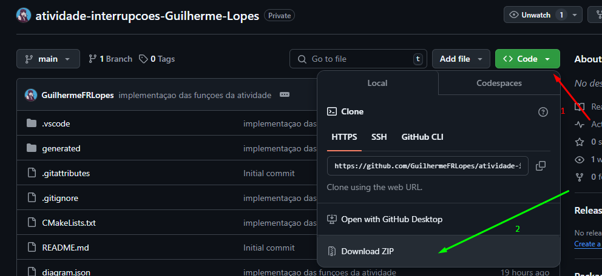
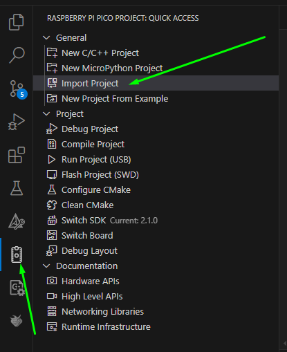
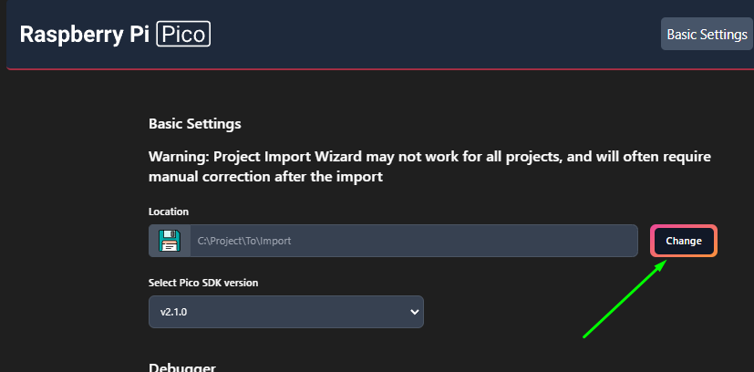

# Tarefa: Controle de Matriz de LEDs WS2812 com Interrupções e Debouncing

##  Descrição do Projeto
Este projeto foi desenvolvido para consolidar os conceitos de interrupções em microcontroladores RP2040, utilizando a placa **BitDogLab**. O objetivo é manipular uma matriz de LEDs **WS2812 5x5**, um **LED RGB** e botões configurados com **interrupção e debouncing via software**.

###  Objetivos do Projeto:
- Implementar **interrupções** para capturar eventos dos botões.
- Aplicar **debouncing via software** para evitar leituras erradas.
- Manipular **LED RGB** e **matriz WS2812** para exibir números de **0 a 9**.
- Criar um sistema funcional combinando **hardware e software**.

---

##  Componentes Utilizados
- **Placa BitDogLab (RP2040)**
- **Matriz WS2812 (5x5)** conectada à **GPIO 7**
- **LED RGB** conectado às **GPIOs 11, 12 e 13**
- **Botão A** (GPIO 5) - Incrementa o número na matriz
- **Botão B** (GPIO 6) - Decrementa o número na matriz

---

##  Funcionalidades Implementadas
1. **Piscar o LED vermelho** do LED RGB 5 vezes por segundo.
2. **Botão A** incrementa o número exibido na matriz de LEDs.
3. **Botão B** decrementa o número exibido na matriz de LEDs.
4. **Matriz WS2812** exibe os números **de 0 a 9** com formatação fixa.
5. **Debouncing via software** para garantir leituras precisas dos botões.
6. **Interrupção (IRQ) nos botões**, evitando polling e otimizando o código.

---

##  Fluxo do Sistema

1. **Inicialização do Sistema**
   - Configura GPIOs para **botões, LED RGB e Matriz WS2812**.
   - Define **interrupções (IRQ)** para capturar eventos dos botões.
   - Aplica **debouncing** para evitar acionamentos errados.

2. **Loop Principal**
   - Mantém o LED RGB Vermelho piscando 5 vezes por segundo.
   - Exibe o **número atual** na matriz WS2812.
   - Aguarda eventos de **interrupção dos botões**.

3. **Tratamento dos Botões**
   - **Botão A pressionado:** incrementa o número e atualiza a matriz.
   - **Botão B pressionado:** decrementa o número e atualiza a matriz.

---

##  Como Executar o Projeto

###  Configuração Inicial
1. baixando o repositório:
   basta clicar em "code", depois clicar pra baixar o zip do repositorio
   
2. extraia o arquivo baixado, e em seguida abra o vs-code
3. Em seguida clique na extensão do pi-pico, e clique em "import Project"
   
4. Depois clique em "change" e selecione a pasta extraida do repositorio, e clique em import pra importar o projeto e fazer a extensao reconhecer como um projeto pi-pico
     
   depois disso uma nova aba do vs-code sera aberta, fique nessa aba;
5. Conecte a **BitDogLab** via USB e ative o modo bootseel, clique na extensao pi-pico novamente e clique em "run Poject(USB), pronto o codigo sera enviado para placa.
video tutorial: (https://youtu.be/0HX_SLXgLSY)
6. outro metodo é clonando o repositorio.

###  Testando no Simulador
Se quiser testar no **Wokwi**, abra o arquivo `diagram.json` e inicie a simulação.

---

##  Demonstração em Vídeo
 **Assista à demonstração do projeto em execução**:

 [Video da execução no hardware](https://youtu.be/H-7ZIRPlWLc)

---

##  Equipe de Desenvolvimento
| Nome | GitHub |
|------|--------|
| Guilherme Lopes | [@GuilhermeFRLopes](https://github.com/GuilhermeFRLopes) |

